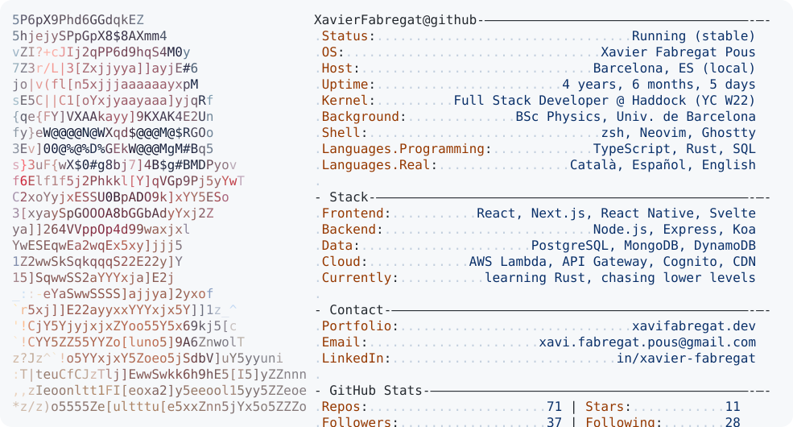

<a href="https://github.com/jeantimex/neofetch-profile">
  <picture>
    <source media="(prefers-color-scheme: dark)" srcset="assets/card-dark.svg">
    
  </picture>
</a>

<!-- The cards are generated by scripts/refresh-cards.sh and committed, so the
     profile never depends on the generator being up at page-load time.
     Edit assets/neofetch.json to change what they say. -->
